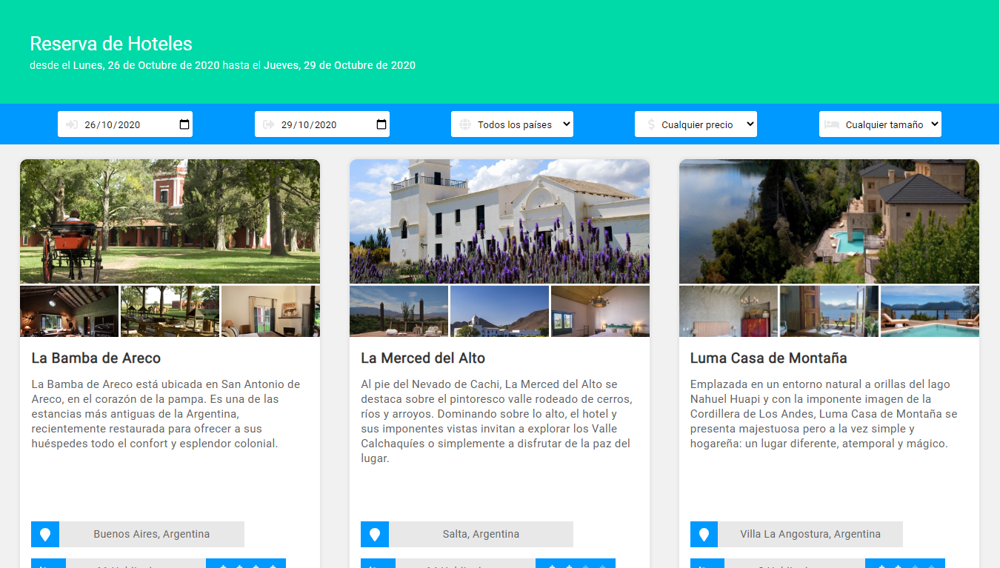
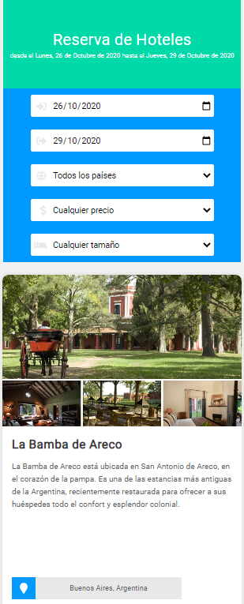
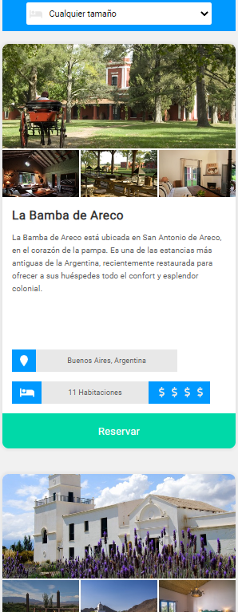

# Hotel reservation

[live demo](https://gusV15.github.io/reserva-hotelera/)

## Build using:

- Embedded React
- Classes Components
  - states
  - props
  - Lifecycle methods
- CSS in JS (styled-components)

## Required:

- Node.js

## How to run the project:

- `npm install` to install dependencies

## License

- MIT